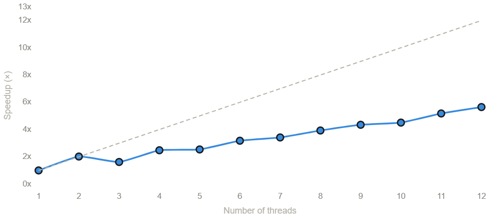
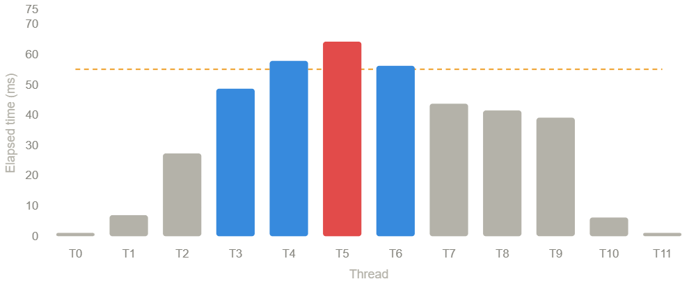

# Assignment 1: Performance Analysis on a Multi-Core CPU

**Group Members**
- Behroz Karim - 2502071
- Hasnain Ajmal -
- Hugo -
- Talha Rizwan - 
- Max Nummila- 2202236
---

## System Information

| Property | Value |
|---|---|
| Architecture | x86_64 |
| Cores | 6 (12 hardware threads, 2 threads per core) |
| SIMD Support | AVX2 (8-wide vector instructions for single-precision float) |
| total Hardware Threads | 12 |
---

## Program 1: Parallel Fractal Generation Using Threads

### Task 1 — Two-Thread Parallelization

For the initial two-thread version, I split the image horizontally at the midpoint. Thread 0 computes the top half and thread 1 computes the bottom half.

```cpp
int half = args->height / 2;

int startRow, numRows;
if (args->threadId == 0) {
  startRow = 0;
  numRows = half;
} else {
  startRow = half;
  numRows = args->height - half;
}

mandelbrotSerial(args->x0, args->y0, args->x1, args->y1, args->width,
                    args->height, startRow, numRows, args->maxIterations,
                    args->output);
```

I then generalized this to work on any number of threads:

```cpp
int rowsPerThread = args->height / args->numThreads;
int startRow = args->threadId * rowsPerThread;
int numRows = (args->threadId == args->numThreads - 1)
                  ? (args->height - startRow)
                  : rowsPerThread;

mandelbrotSerial(args->x0, args->y0, args->x1, args->y1, args->width,
                  args->height, startRow, numRows, args->maxIterations,
                  args->output);
```

**Results with 2 threads:**

| View | Serial (ms) | Threaded (ms) | Speedup |
|---|---|---|---|
| View 1 | 297.9 | 148.0 | 2.01x |
| View 2 | 169.0 | 99.8 | 1.69x |

View 1 is symmetric about the horizontal midline, so each half has roughly equal computational cost, which is why we see almost exactly 2x speedup. View 2 is not as balanced, so the speedup drops to 1.69x.

### Task 2 — Scaling Up to All Hardware Threads

I extended the code to support any number of threads up to `std::thread::hardware_concurrency()` (which is 12 on my machine). Each thread gets a contiguous block of rows, with extra rows distributed to the first few threads:

```cpp
int totalHeight = args->height;
int numThreads = args->numThreads;
int threadId = args->threadId;

int rowsPerThread = totalHeight / numThreads;
int remainderRows = totalHeight % numThreads;

int startRow, numRows;
if (threadId < remainderRows) {
  numRows = rowsPerThread + 1;
  startRow = threadId * numRows;
} else {
  numRows = rowsPerThread;
  startRow = threadId * numRows + remainderRows;
}

mandelbrotSerial(args->x0, args->y0, args->x1, args->y1, args->width,
                  args->height, startRow, numRows, args->maxIterations,
                  args->output);
```

**Speedup results (View 1):**

| Threads | Speedup (View 1)| Speedup (View 2)
|---|---|---|
| 1 | 1.00x |1.00x
| 2 | 2.02x |1.69x
| 3 | 1.62x |2.19x
| 4 | 2.48x |2.54x
| 5 | 2.54x |2.97x
| 6 | 3.18x |3.32x
| 7 | 3.42x |3.66x
| 8 | 3.93x |4.11x
| 9 | 4.35x |4.48x
| 10 | 4.51x |4.80x
| 11 | 5.18x |4.95x
| 12 | 5.65x |5.52x



The speedup is clearly not linear. The strangest result is with 3 threads on View 1, where speedup actually drops from 2.02x to 1.62x. At first this seems counterintuitive like how can adding a thread make things slower?

The explanation has to do with how the Mandelbrot set looks. View 1 is symmetric about the center line. With 2 threads, each thread gets an exact mirror image of the other so the work is perfectly balanced, giving us close to 2x speedup. But with 3 threads, the image gets cut into three horizontal strips. Thread 0 and Thread 2 end up with mostly the dark regions at the top and bottom of the image where pixels escape quickly (very few iterations). Thread 1, the one in the middle, gets stuck with the entire bright boundary region where pixels need the full `maxIterations`. So Thread 0 and 2 finish almost instantly while Thread 1 is still working doing 60-70% of the total work alone. Since total runtime is limited by the slowest thread, performance barely improves over a single thread.

In View 2, the computational work is distributed differently, so the 3-thread case doesn't suffer as badly and it actually gives 2.19x speedup there.

The main problem here is **load imbalance**. Because we split the image into contiguous horizontal strips, some threads always get the expensive centeral rows while others get the cheap edge rows. Adding more threads helps somewhat because each strip gets thinner, but the imbalance never fully goes away with this decomposition strategy.

### Task 3 — Per-Thread Timing

To confirm the load imbalance hypothesis, I added timing code inside `workerThreadStart()` to measure how long each thread actually takes.

**2 threads (View 1):**
```
Thread 0 elapsed time: 149.946 ms
Thread 1 elapsed time: 151.275 ms
```
Nearly identical — consistent with the symmetric workload split.

**3 threads (View 1):**
```
Thread 0 elapsed time:  59.099 ms
Thread 1 elapsed time: 185.387 ms
Thread 2 elapsed time:  60.456 ms
```
Thread 1 takes more than 3x as long as the other two. This confirms the problem — the middle strip contains almost all the expensive computation.

**12 threads (View 1):**
```
Thread 0:   1.270 ms    Thread 6:  56.469 ms
Thread 1:   7.125 ms    Thread 7:  43.952 ms
Thread 2:  27.516 ms    Thread 8:  41.720 ms
Thread 3:  48.907 ms    Thread 9:  39.324 ms
Thread 4:  58.099 ms    Thread 10:  6.345 ms
Thread 5:  64.457 ms    Thread 11:  1.286 ms
```



The imbalance is massive. Threads at the edges (0, 1, 10, 11) finish in under 7 ms, while Thread 5 in the center takes over 64 ms. The overall runtime (55.4 ms) is dictated entirely by these middle threads. The rest are just sitting idle, wasting cores.

This data directly explains the speedup graph: no matter how many threads we throw at it, the contiguous block decomposition will always bottleneck on whatever thread gets the most expensive part of the Mandelbrot boundary.

### Task 4 — Improving Speedup using Interleaved Row Assignment

To fix the load imbalance and improve speedup, I switched from contiguous blocks to an interleaved (cyclic) assignment. Instead of giving each thread a solid chunk of rows, each thread processes every N-th row:

```cpp
int totalHeight = args->height;
int numThreads = args->numThreads;
int threadId = args->threadId;

for (int row = threadId; row < totalHeight; row += numThreads) {
  mandelbrotSerial(args->x0, args->y0, args->x1, args->y1, args->width,
                    args->height, row, 1, args->maxIterations,
                    args->output);
}
```

So with 12 threads, Thread 0 gets rows 0, 12, 24, 36, ...; Thread 1 gets rows 1, 13, 25, 37, ...; and so on. Every thread ends up with a roughly equal number of cheap rows and expensive rows, balancing the load naturally.

**Comparison — Block vs. Interleaved decomposition:**

| Threads | View 1 (Block) | View 1 (Interleaved) | View 2 (Interleaved) |
|---|---|---|---|
| 2 | 2.02x | 2.02x | 2.04x |
| 3 | 1.62x | 3.05x | 2.91x |
| 4 | 2.48x | 3.98x | 3.89x |
| 5 | 2.54x | 4.58x | 4.13x |
| 6 | 3.18x | 5.48x | 4.93x |
| 7 | 3.42x | 5.99x | 5.58x |
| 8 | 3.93x | 6.27x | 5.87x |
| 9 | 4.35x | 6.90x | 6.38x |
| 10 | 4.51x | 7.27x | 6.73x |
| 11 | 5.18x | 7.72x | 7.39x |
| 12 | 5.65x | 8.29x | 7.69x |

The improvement is dramatic. The 3-thread anomaly completely disappears (3.05x instead of 1.62x), and we reach **8.29x on View 1** and **7.69x on View 2** with 12 threads, both well above the 7x target.

The interleaved approach works well because every thread gets a similar mix of easy and hard rows, regardless of thread count or which view we're rendering. It is a simple static assignment that requires no synchronization or communication between threads.

### Task 5 — Running with 2x Hardware Threads

I ran both the interleaved and contiguous implementations with 24 threads (double the 12 hardware threads).

For the **interleaved** version, performance did not improve. This actually makes sense. Threads are a software abstraction, not a physical resource. My CPU only has 12 hardware threads, so any additional software threads beyond that will be time-sliced by the OS, adding context-switching overhead without providing any extra compute capacity. Since the interleaved assignment already keeps all 12 hardware threads busy with balanced work the entire time, there is simply no idle time for extra threads to exploit.

For the **contiguous** version (Task 2 version of code), however, doubling the thread count actually helped, achieving around 7x speedup, a big jump from the ~5.4x at 12 threads. This happens not because we suddenly have more hardware parallelism, but because of an accidental benefit: with 24 threads, each contiguous block is half the size, so no single thread gets stuck with as large a chunk of the expensive center region. The smaller blocks partially correct the load imbalance that was affecting the contiguous approach. It is not really a gain from more parallelism but it is the smaller granularity that is accidentally making the work distribution less unbalanced.

---

## Program 2: Parallel Fractal Generation Using ISPC

### Part 1 — ISPC SIMD Execution

I compiled and ran `mandelbrot_ispc` targeting AVX2, which gives 8-wide SIMD vector instructions on my x86-64 CPU.

**Results:**

| View | ISPC Speedup over Serial |
|---|---|
| View 1 | 3.59x |
| View 2 | 2.87x |

The theoretical maximum speedup with 8-wide SIMD is 8x, but we're only getting about 3.5-3.6x. The reason is SIMD lane divergence caused by the variable iteration count per pixel.

In the Mandelbrot kernel, each pixel runs through a loop that exits when `z_re * z_re + z_im * z_im > 4.f`. With SIMD, 8 pixels are processed together in one vector. But different pixels escape the loop at different times. Once a pixel escapes, its SIMD lane becomes inactive (masked off), but it still has to wait for the other lanes in the same vector to finish. So if 7 out of 8 pixels escape early but one pixel takes the full `maxIterations`, all 8 lanes run for the full count, means wasting 7/8 of the computation on that iteration.

The worst case for SIMD is right along the boundary of the Mandelbrot set, where adjacent pixels can have wildly different escape times. Large uniform regions (fully inside or fully outside the set) vectorize much better because neighboring pixels tend to behave similarly.

View 2 has more of this fine boundary structure and irregular escape behavior, which is why it gets a lower speedup (2.87x) compared to View 1 (3.59x). This confirms that lane divergence is the main bottleneck.

### Part 2, Task 1 — ISPC Tasks (Multi-Core + SIMD)

Running with the `--tasks` flag, which uses `launch[2]` to split work across 2 tasks (and thus 2 cores):

| View | ISPC Only | ISPC + Tasks | Task Speedup over ISPC |
|---|---|---|---|
| View 1 | 3.51x | 7.24x | ~2.06x |
| View 2 | 2.80x | 4.87x | ~1.74x |

With tasks enabled, we get roughly 2x on top of the SIMD speedup for View 1, which makes sense, two tasks run on two separate cores, each still benefiting from SIMD within that core. View 2 doesn't scale as cleanly because the two halves of the image have unequal computational cost.

### Part 2, Task 2 — Tuning the Number of Tasks

I modified `mandelbrot_ispc_withtasks()` to launch more tasks and experimented with different values:

```
32 tasks:   (25.93x speedup from task ISPC)
100 tasks:  (29.91x speedup from task ISPC)
```

The final implementation uses a large number of tasks. The relevant code change in `mandelbrot.ispc`:

```c
export void mandelbrot_ispc_withtasks(uniform float x0, uniform float y0,
                                      uniform float x1, uniform float y1,
                                      uniform int width, uniform int height,
                                      uniform int maxIterations,
                                      uniform int output[])
{
    uniform int numTasks = 100;
    uniform int rowsPerTask = height / numTasks;

    launch[numTasks] mandelbrot_ispc_task(x0, y0, x1, y1,
                                     width, height,
                                     rowsPerTask,
                                     maxIterations,
                                     output);
}
```

I determined the number of tasks experimentally. Starting from 2, I kept increasing and measuring speedup. Performance improved as I added more tasks up to 800. I got the best performance at 100 tasks where I got close to 30x speedup. The reason more tasks helps is the same load balancing argument: the Mandelbrot workload is irregular, so if you only have a few large tasks, some will be much heavier than others. With many small tasks, the ISPC runtime can dynamically assign them to worker threads as they become available, keeping all cores busy.

But increasing indefinitely doesn't help. Once tasks get too small, the overhead of creating and scheduling them starts diminish the gains. On my system the sweet spot was at 100 tasks. Increasing the tasks more than 100 started to reduce the perforamnce gain.

The fact that I didn't quite hit the full 32x is likely due to a few factors: background OS activity, and the fact that I'm running under WSL which adds some overhead. 

### Part 2, Task 3 — Threads vs. ISPC Tasks

The key difference between `std::thread` and ISPC tasks is what they represent at the system level.

A `std::thread` is a full OS-managed execution context. Each one gets its own stack, its own scheduling state in the kernel, and the OS is responsible for deciding when and where it runs. Creating a thread involves a system call, and switching between threads requires saving and restoring a lot of state. So if you launch 10,000 threads, you're asking the OS to manage 10,000 separate execution contexts. Each needs its own stack memory, so that's potentially gigabytes of memory just for stacks. The OS scheduler has to deal with 10,000 entries, context switches become very frequent, and the most of the CPU time goes into scheduling overhead rather than actual computation.

ISPC tasks, on the other hand, are lightweight work items managed by a user-space runtime, not the OS. When you `launch[10000]`, you're not creating 10,000 threads. The ISPC runtime maintains a small fixed pool of worker threads (typically matching the hardware thread count) and puts all 10,000 tasks into a work queue. Each worker thread grabs a task, runs it, then grabs the next one. 

This also gives us dynamic load balancing for free. If one task finishes faster than expected, its worker thread immediately picks up the next available task. With raw threads, if you statically split work into 10,000 chunks, there's no mechanism to redistribute, in that case the early finishers just wait.

So in short: threads are a heavy, OS-level primitive where we're explicitly creating independent execution contexts. Tasks are a lightweight, runtime-managed abstraction where we're describing work items and letting the system figure out the scheduling.

---

## Program 3: Iterative sqrt

### Task 3

#### Task 1

```cpp
/*
Task 1 Output
[sqrt serial]:          [691.818] ms
[sqrt ispc]:            [138.840] ms
[sqrt task ispc]:       [12.267] ms
                                (4.98x speedup from ISPC)
                                (56.40x speedup from task ISPC)
*/
```
The speedup due to SIMD is of x4.98 while the one for SIMD with multicore is 56.4, concluding that the multicore paralelization.
Therefore, the multicore paralelization provides 56.4 / 4.98 = x11.32 speedup.

#### Task 2

```cpp
/*
Task 2 Output
[sqrt serial]:          [13.955] ms
[sqrt ispc]:            [9.143] ms
[sqrt task ispc]:       [7.882] ms
                                (1.53x speedup from ISPC)
                                (1.77x speedup from task ISPC)
                                (56.40x speedup from task ISPC)
*/
```
The answer here is to set the initial values to 1 (which is the initial guess) so the sequential version is able to finnish in the first iteration. 

#### Task 3

```cpp
/*
Task 3 Output
[sqrt serial]:          [13.775] ms
[sqrt ispc]:            [9.481] ms
[sqrt task ispc]:       [7.791] ms
                                (1.45x speedup from ISPC)
                                (1.77x speedup from task ISPC)
*/
```

After setting all the array values to 1 (which is the initial guess so the calculation of the sqrt goes down to O(1)).
We can see that the speedup both for SIMD and multicore parallelization it's almost none, which can be explained by using the same concepts when building divide and conquer algorithms.
This is a case where we have to split the problem, solve it, and then join the results. Both splitting and joining have a cost, but as long as the computation is faster there is margin for improvement. Since here the computation of every instance is almost the same, and is really low, adding more cores or ALU units can not significantly overcome the cost of splitting and joining.


---

## Program 4: BLAS `saxpy`

### Task 1 — ISPC Performance on saxpy

```
[saxpy ispc]:           [9.158] ms      [32.542] GB/s   [4.368] GFLOPS
[saxpy task ispc]:      [6.328] ms      [47.097] GB/s   [6.321] GFLOPS
                                (1.45x speedup from use of tasks)
```

The task version is only 1.45x faster than the non-task ISPC version, which is a fairly modest improvement considering we have 6 physical cores available.

The reason is that `saxpy` is an extremely memory-bound computation. For every element, we do just two arithmetic operations (one multiply, one add) but we need three memory accesses (load X, load Y, store result). The CPU can do the math almost instantly but the bottleneck is waiting for data to come from and go to main memory.

The plain ISPC version already saturates most of the available memory bandwidth through SIMD vectorization on a single core. When we add tasks to use multiple cores, those cores all share the same memory bus. So instead of each core getting its own bandwidth, they're all competing for the same limited memory. The extra cores can do the arithmetic faster, sure, but the memory system can't feed them data any faster than it could feed one core.

Also I do not think this can be substantially improved to get anything close to linear speedup. Even if the code were rewritten or the number of tasks were tuned more carefully, the program would still be limited mostly by memory bandwidth. So there might be small gains from better tuning, but not a near-linear speedup, because the bottleneck is the memory system, not the amount of available compute.

### Task 2 — Why the 4x Multiplier for Bandwidth

At first glance, `saxpy` does:
- 1 load from `X[i]`
- 1 load from `Y[i]`
- 1 store to `result[i]`

So one would expect 3 x N x `sizeof(float)` bytes of memory traffic. But the code uses 4 x N x `sizeof(float)`, and this is actually correct.

The extra factor comes from how CPU caches handle stores. When the CPU writes to `result[i]`, it doesn't just write directly to memory. With a typical write-allocate cache policy, the CPU first needs to load the entire cache line containing `result[i]` into the cache before it can modify the relevant bytes. This is called a **read-for-ownership (RFO)**, the CPU reads the old cache line contents (even though we're about to overwrite them) so it has ownership of that line in the cache coherence protocol.

So in practice, each write to `result[i]` causes a **read** of the cache line and then later a write-back of the modified cache line to memory

That makes the total memory traffic per element: read X + read Y + read result (RFO) + write result = 4 memory operations. Hence the 4x multiplier is the accurate based on actual bytes moved between the CPU and main memory.

---