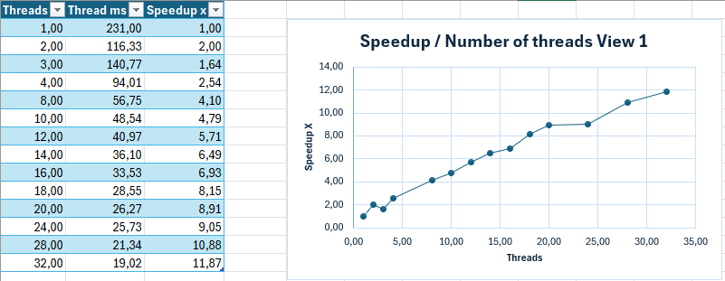

**Program 1 Notes**

***Task 1***

For the first task I started by coming up with how I could separate the work for the threads, and did that by splitting the task up by dividing the amount of rows by the amount of threads. I then assigned the rows and the starting rows to the threads but initially forgot to actually use it in the mandelbrot serial function so it did nothing. But after getting it to work I tested it with two threads and got a 1.99x speedup, which was expected, but then when I tried with 3 threads I only got a 1.64x speedup, which was less than with two threads. 
I wondered if I had done something wrong but when testing with 4 threads it was a 2.45x speedup, so it seemed to be working. 

After thinking for a while I figured that it was due to the division giving a way harder to process part to one of the threads and thus slowing down the process.

***Task 2***

The code that I made for task 1 should work for task 2 as well as long as one specifies the amount of threads in the run command with the flag -t. My processor has 32 threads, so I did not run it with each number between 1 and 32 but enough to make a solid graph. 

This is the graph that was created and from it one can see that the speedup is not linear, but has some bumps on the way depending on the amount of threads. The significant ones are 3, 16 and 24.

The amount of threads seems to however lead to an increase in performance in every scenario except for 3 threads. My best explanation for this phenomenon is that the sections are not evenly difficult to process. I say this due to how the picture looks, some rows are nearly fully black while other rows are mostly white, and since the brightness of each pixel is proportiojnal to the computational cost, this means that the mostly white rows will take way longer than the nearly black ones. When the picture is divided in certain numbers of threads some threads will get a way whiter row than others, and in these scenarios the other threads will have to wait for that one complex one. Thus, I also expect the three thread scenario to be so slow due to the second thread getting the center of the picture. When that happens in gets nearly all the difficult pixels, while they were split evenly in the two thread scenario. 
